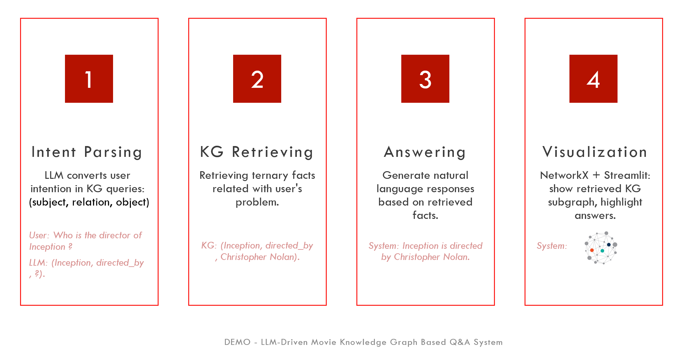

# **LLM-Driven Movie Knowledge Graph QA System**

This repository contains the code, data, and demo video for my personal project on lightweight question-answering (QA) using a Knowledge Graph (KG) and a small LLM (Gemma 2B-It). The system focuses on providing accurate, explainable answers to movie-related questions, covering movies released between 2000 and 2017. The project is designed to run entirely on CPU, demonstrating the power of lightweight LLMs combined with structured knowledge graphs.

---

## **Project Overview**

The goal of this project is to build a QA system that answers movie-related questions in natural language using a curated knowledge graph. 
The systeme includs: 

---

## **Dataset**

The dataset used in this project is from [**Kaggle - The Movies Dataset**](https://www.kaggle.com/datasets/rounakbanik/the-movies-dataset) based on [**MovieLens**](https://grouplens.org/datasets/movielens/latest/), focusing on films released between 2000 and 2017. 
The Movie KG includes:
- Movie titles, genres, release years, directors, and actors.
- Preprocessed and stored in triple format: (Subject, Predicate, Object) in `/data/20002017_triples.csv`.

---

## **Demo Video**

A demonstration video is available to showcase the system’s capabilities in answering typical movie-related questions.  
🎥 [Demo Video Link](https://www.youtube.com/watch?v=qd1PL1texTk)

Example questions demonstrated in the video:
- What is the release year of The Martian?
- Who directed The Grand Budapest Hotel?
- What genre is Inception?
- What movies did Leonardo DiCaprio act in?

---

## **Deployment**

The system is deployed on **Huggingface Spaces**, allowing users to interact with it online. It runs entirely on CPU, demonstrating the feasibility of lightweight LLM-driven QA systems in low-resource environments.  
👉 [Try it online](https://huggingface.co/spaces/HappyOtter/LLM-Driven-Knowledge-Graph-QA-System).

---

## **License**

This project is licensed under the Apache License 2.0. See the [LICENSE](./LICENSE) file for more details.
